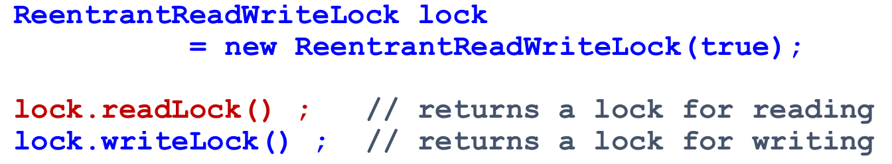

# CM3113 Concurrent Programming Exam Revision

* ***Sequential Programming*** - A _single thread_ of execution that processes the instructions one by one
* ***Concurrent Programming*** - _Two or more threads_, each process their own sequences of instructions concurrently

### Advantages of Concurrency

Practical reasons for Concurrent Programming:
* To develop _responsive_ programs that do not waste CPU cycles - web servers, cloud-based systems
* To make most efficient use of CPU time - embedded systems, games
* To model inherently concurrent real-world scenarios - simulators, distributed systems
* To exploit multi-processor hardware - partitioning solution into separate threads

Most common use case for Concurrent Programming:
* ***I/O Bound tasks*** that are limited by slow speed of external resources, or the slow input or output of data flow (
e.g.: standard problem in operating system design - writing to an external device, or accessing slower memory )
  * Instead of using an inefficient 'busy-wait' design pattern, utilize **'blocked-wait'** using threads, where the
  waiting thread does not use CPU while waiting
* ***Compute Bound tasks*** that require lengthy and / or computationally demanding processing, that will delay program
process
  * Can lead to an unresponsive program - better to run lengthy calculations in a **separate thread**

<u>Performance Advantages of Multi-Threading:</u>
* **Performance gains**
* **Improved throughput**
* **Improved responsiveness**

These can be achieved by: 
>* Execute threads in true parallelism on different cores
>* Split complex parts into simpler parts running on separate threads 
>* Scheduling asynchronous tasks (use separate threads for user interaction and back-end
processing)

### Drawbacks of Concurrency

<u>Performance Limitations of Multi-Threading:</u>
* **Creating threads has a performance cost** - _overhead of thread creation, clean-up and recovering stack space can
impact performance_
* **Thread context switching has a performance cost** - if there are more long-lived threads than there are cores
available, threads will have to share access to the cores &rarr; context switching is inevitable
* **Each thread needs stack space 'borrowed' from virtual memory** - exhausting virtual memory

<u>Risks associated with Multi-Threading:</u>
* **Data safety hazards** - _if multiple threads access and change shared data then mutually exclusive access and
visibility of changes must be ensured_
* **Liveness issues** - _threads can block each other or can be left waiting for others to finish, if multiple threads
need to exchange data then proper coordination and scheduling must be ensured_
* **Debugging** - _concurrent programs are inherently non-deterministic, hence errors can appear inconsistent_

### Process

>***Process***: _a program running on the machine, and the state of its execution_

Processes share the CPU, where each process is allocated ***Virtual Memory*** address space by OS. The ***Memory
Management Unit*** (MMU) uses address translation (page) tables to map virtual memory addresses, associated with a 
process, to _physical memory_ addresses.

**Memory Map for a Process:**

* **GLOBAL DATA** - class meta-data
* **HEAP MEMORY**:
  * Global &rarr; all threads in a process see the same process heap space
  * Complex RAM management - same access speed for all data, but slower than Stack
  * Stores object data - any thread with reference to an object should see the same object data
  * Dynamic size - can expand and contract
* **STACK MEMORY**:
  * Each thread has its own Stack space, that other threads cannot access
  * Simple LIFO memory management - faster than Heap, but slower than CPU Registers
  * Threads save object references in their stack space that point to objects stored in the heap
  * Limited size - if exceeded &rarr; _StackOverFlowError_

**CPU Internal Registers**:
The Memory Management Unit 'links' the CPU to processes using memory pointers stored in small / fast memory registers on
CPU
* **Program counter** - A register that stores virtual address of the next instruction in process "thread" of execution
* **Stack pointer** - A small register that stores the memory address of the last data element added 
to the stack or, in some cases, the first available address in the stack.

**Process State:**

Multi-process operating systems use a ***process table*** to track the state of all processes 

Characteristics of process state:
* **Readiness Status** - whether ACTIVE, BLOCKED, READY
* **Metadata** - process ID, owner ID, group ID
* **CPU Register Values** - of Process Counter, Stack Pointer, Data Registers
* **MMU Register Values** - containing virtual memory address translation tables
* **Open File Handles & Buffers** - e.g.: resources held by process

***The process state must be saved and re-instated when one process replaces another on the CPU***

**Interrupts and Process Context Switching**

The System (real-time) Clock maintains date & time on the system and can be used to ***schedule periodic process context
switches***

***An INTERRUPT can be used to enforce a PROCESS CONTEXT SWITCH***

>***Interrupt*** - a signal to a processor indicating that something requires attention:
* interrupt alerts processor to handle condition requiring interruption of current running process
* processor suspending current process, saves its state, and runs an ISR (Interrupt Service Routine) to handle the event
* interruption is temporary - after interrupt handler finishes, processor resumes normal activities
* happens at the OS / Machine level - NOT the same as Java Interrupt Flag

**When an interrupt instructs the processor to switch process:**
* Hardware switches to a privileged mode
  1. CPU + MMU registers, virtual memory addresses & process state are saved
  2. Interrupt Service Routine (ISR) clears interrupt request
  3. CPU scheduler selects next process and sets pointer to selected process
  4. Registers and tables are restored for the next active process state
* Hardware switches back to user mode (e.g.: next process starts to run on CPU)

A machine may have hundreds of processes running, but limited number of processors &rarr; if context switches are
frequent, all processes appear to make concurrent progress (illusion of concurrency)

Cost &rarr; a small proportion of CPU time is used to manage Process switching itself

### Thread Context Switch

Within a process, several threads may exist, these threads must share the overall CPU time allocated to their process

***Thread Context Switching is used to swap threads onto / off the processor***

Similar to Process Context Switch, but instead of the CPU scheduler, the **Thread scheduler** selects the next thread
1. CPU registers (PC, SP, data registers) are saved
2. ISR clears interrupt request
3. THREAD scheduler selects next thread
4. CPU registers (PC, SP, data registers) are restored

**THREAD Context Switch << PROCESS Context Switch** - less time / resource used since no need to save and restore:
virtual memory addresses or process state information

Within each process there can be multiple threads taking turns on CPU time, all threads in a process share the SAME:
* process (virtual) address space
* process housekeeping data
* global data and heap
* process resources e.g.: files

--------------------------

***JVM steps:***
1. Machine-independent Java source code written by the programmer
2. Java compiler translates source code to intermediate, universal, BYTECODE
3. BYTECODE is interpreted by OS specific JVM and converted to instructions that run on the specific OS

***The JVE consists of:***
* the JVM
* the Java API
* the Host operating system on which the JVM is running

Java code is intended to be platform independent, hence designed with limited programmer control over the native machine.
However, there are some Java classes that can be utilized to get information about the physical machine:
* **Runtime** - Runtime object created when the application is run, interacts with the underlying system, and the JVM
* **System** - Provides a virtual link to the real system from inside Java
* **Process** - Provides some control over native processes from inside Java

### Ways of creating Threads in Java

**The _Runnable_ Interface**:

> The purpose of implementing the Runnable type is to create runnable objects that contain tasks that can be submitted
> to run on a Thread 

To implement a Runnable interface, a class must implement a void ***run()*** method that contains the task to be run on the 
Thread

**The _Thread_ Class**:

There are two low-level ways to create a ***new Thread***:
* Implement the ***Runnable Interface***, and submit a Runnable object to a Thread object
  * The implementing class can also inherit from any other class hence more scope for code reuse
  
  
  
* Extend the ***Thread Class***, override the run() method, construct an instance of it. and start() it
  * Java only supports single inheritance, hence if we extend the _Thread_ class we cannot inherit behaviour from any 
  other classes
  
  

**Role of and difference between run() and start()**:
* ***start() method***:
  * Invokes thread's run() method on its own separate thread of execution
  * Thread objects can only be started once!
  * To 'repeat' a task in a thread - construct new thread object and call 'start()' (Create TimerTask object)
* ***run() method***:
  * Does NOT do the same as 'start()' - does NOT invoke 'run()' directly
  * Simply executes the task on the 'main' thread rather than in a separate thread

### Possible states of Java Threads

**What is the role of each state**:
* ***NEW***:
  * status of a Thread that has been created, but not yet been started
* ***RUNNABLE***:
  * Thread is either _'active'_ (e.g.: running on the CPU)
  * Or _'ready'_ (e.g.: in queue awaiting turn to run on the CPU) - Runnable does not imply that it is running
* ***BLOCKED***:
  * state of a Thread that is not currently scheduled for CPU time specifically because it is _awaiting access to a 
  synchronised piece of code_.
* ***WAITING / TIMED_WAITING***:
  * states in which a Thread is not currently scheduled for CPU time due to:
    * it has instructed itself to 'sleep' by invoking _'Thread.sleep()'_
    * it is waiting for another Thread (t) to finish after invoking 't.join()'
    * it is awaiting an instruction to proceed after invoking 'obj.wait()' on an object
  * Timed version implies a time limit on the pause
* ***TERMINATED***:
  * Thread that has fully completed the code in its run() method or its assigned runnable task's run() method

**Thread transitions between states**:
* &rarr; ***NEW***:
  * initial state, Thread has not been started - 'start()' method has not yet been invoked
* ***NEW*** &rarr; ***RUNNABLE***:
  * by invoking 'start()' method - no transition back to NEW state
* &rarr; ***TERMINATED***:
  * once code in the run() method fully completed - no transition back from TERMINATED state
* ***RUNNABLE*** &harr; ***BLOCKED***:
  * BLOCKED state specifically linked to 'synchronised' code
  * a Thread enters BLOCKED when it has to wait to access a synchronised code, leaves BLOCKED when gains access to 
  synchronised code
* ***RUNNABLE*** &harr; ***WAITING or TIMED_WAITING***:
  * RUNNABLE Threads enter WAITING state when:
    * invoke 'Thread.sleep()' from within the thread
    * invoke 't.join()' to wait for another thread to finish
    * invoke 'obj.wait()' to wait for a signal from an object
  * WAITING and TIMED_WAITING threads can be un-paused and returned to RUNNABLE state by:
    * invoking 'interrupt()' on the thread
    * invoking 'obj.notify()' or 'obj.notifyAll()' on an object on which the thread has previously invoked 'obj.wait()'

### Java Thread Scheduling Policy

**Java Scheduling Policy**:
* JVM maps Java threads to underlying OS native threads  
<u>Note:</u> there might not be correspondence between Java thread priorities and native OS thread priorities &rarr; 
setting Thread priorities in Java is not guaranteed to always have precise effect intended
* Important whenever _number of threads_ > _number of cores_ - very strong influence on liveness aka the ability of 
threads to make progress
* Frequent thread context switching creates an illusion of _'PSEUDO-PARALLELISM'_
* A higher priority thread will ***PREEMPT*** a lower priority active thread
* For threads of equal priority - the ***round-robin time-slicing*** policy - _equal time slices assigned to all threads
of equal priority in circular order_

---------------------------

### Purpose, role, effects, impacts of:

* ***Thread priority***: JVM schedules the highest priority threads first and waits for them to complete before scheduling
lower priority threads
  * threads of equal priority get equal share of CPU time
  * new thread inherits same priority as the thread it was created in
  * integer value (MIN - 1; NORMAL - 5; MAX - 10) - main method has priority 5
* **isAlive()** - used to check whether a thread has reached its 'terminal' state
  * returns 'true' if thread has been started and has not yet stopped
* **join()** - invoking 't.join()' will make the current thread wait until thread (t) finishes execution
  * it can throw 'InterruptedException' so must be wrapped in try-catch
  * the Thread calling the method will block in WAITING state until target thread (t) reaches its terminal state
* **interrupt()** - allows other threads to interrupt execution of this thread
  * calling 't.interrupt()' sets interrupt flag to true if thread t is not blocked
  * else throws 'InterruptedException' and clear interrupt flag
  * useful when the thread to be interrupted performs some repetitive task
* **wait()** - inherited from 'Object' class - makes current thread wait until thread (t) calls 'notify()' or 'notifyAll()'
  * can accept parameters to specific max wait time
  * notify() - wakes up a thread that is waiting on thread (t) to finish 
* **Thread.yield()** - indicates to JVM that current thread is willing to release its current CPU slot
* **Thread.sleep()** - causes current thread to pause for time (ms) specified
  * making a thread go to sleep, gives access to the thread's CPU time
  * at the end of sleep, thread becomes RUNNABLE again - will be returned to scheduling and be either active or ready
  * sleeping thread can be interrupted, hence code should be wrapped in try-catch

### Daemon and Non-Daemon Threads

* Daemon threads run 'in the background'
* ***Daemon threads are automatically terminated when all other non-daemon threads have terminated, hence they will not
delay program termination***
* A new thread inherits daemon status from its creator thread (main is non-daemon)
* Non-Daemon threads are also called user threads

### Advantages of high-level thread Management

***Limitations of low-level Threading***:
* Performance impact - performance and resource overhead - initialising thread object, context switching, etc.
* Instances of Threads do not normally return a value of information
* Many use cases for multi-threading involve timing, repetition, and co-ordination of threads &rarr; additional design 
and implementation

***High-level multi-threading features to overcome limitations***:
* **Thread Pools** - _Executors_ create pools of ***re-usable*** threads that can efficiently manage multiple tasks
* **Callable or Future objects** - run multi-threading tasks that can return objects
* **Other high-level thread synchronisation objects** - Timers, TimerTasks, CyclicBarriers, CountDownLatch, etc.

***Executors in java.util.concurrent***:
* **Executor**:
  * base interface for re-usable pools of threads that can execute multiple tasks
  * has an _'execute()'_ method for running Runnable tasks
  * uses shared and re-usable worker threads that can run multiple tasks, without the overhead cost of creating a new 
  thread for each task
* **ExecutorService** inherits from Executor:
  * methods to manage the lifecycle of the executor and its tasks (shutdown, awaitTermination, etc.)
  * a _'submit()'_ method that can accept Runnable objects or run Callable tasks that return Future objects, used to 
  retrieve a return value
* **ScheduledExecutorService** inherits ExecutorService:
  * adds methods that support delayed and / or periodic execution of tasks

***Thread Pools***:

<u>A _thread pool_ consists of:</u>
* a **work queue**, that accepts tasks (Runnable, Callable objects) waiting to be executed
* a collection (pool) of **available tasks**, that check the work queue for tasks to run
* when a task arrives at the front of the queue, an available worker thread from the pool will execute its task
* types of thread pools:
  * ThreadPoolExecutor - a pool of threads to execute and manage submitted tasks
  * ScheduledThreadPoolExecutor - similar, extra functionality for scheduling tasks with delays and repetition
  * ForkJoinPool - pool suited to tasks that can be sub-divided and spread across multiple parallel processors

<u>Benefits of Thread Pools:</u>
***Thread pools conceptually separate the Thread object from the tasks that run in the thread*** - with low-level
threading the Thread and the Runnable task are bound together &rarr; each task needs its own Thread object

* The Thread Pool exists independently of the tasks that run on it
* The pool is a _multi-threading channel_ into which tasks can be submitted
* The pool can run multiple tasks without having to create a separate Thread object for each
* If a pool thread is terminated while it is still in use, it is automatically replaced with a new Thread
* Tasks are submitted to an internal work queue, which queues tasks if there are more active tasks than threads

***Using Thread Pools minimizes overhead of thread creation*** - Thread object use a significant amount of memory &rarr;
allocating and de-allocating many thread objects creates a significant memory management overhead

***Optimal size of Thread Pool***: 

-------------------

### Sharing Data Between Threads

***All threads within a process share the same process memory space (global variables, heap space)***, hence threads
can share objects and data

**Shared data can be used as:**
* **Common storage** - shared collection objects can be used as a shared _'database'_
* **Coordination** - shared objects can signal the current state of a thread
* **Communication** - for example a shared _'message'_ buffer

**Possible problems when Threads share data:**
* **Race Condition** - occurs if results can depend on the particular interweaving (timing and ordering) of multiple
threads
* **Data Race Condition** - occurs if data is shared by multiple threads, and is changed by at least one of them,
different ordering of access can lead to incorrect and / or unpredictable results
* **Issues with cached variables** - data inconsistency

### Interweaving of Threads

**An _Interweaved Instruction Sequence (IIS)_ is a sequence of code operations actually run on the processors(s) during
concurrent execution...**
* when multi-threading, code from several threads may take turns to progress
* but the order in which equal priority threads access CPU can't be predicted
* and exact position within a thread's code that threads switch can't be predicted
* hence, all possible machine level instruction sequences must be considered

**IIS are NOT UNIQUE**: the same program may generate a different IIS on each occasion, or on different processors, or 
on different numbers of available processors

***A single high-level Java statement can compile into multiple low-level machine instructions!*** - Non-Atomic 
Operations on Integers (e.g.: x = x + y), since arithmetic operations on ints are divisible!

### Thread Safety

***Because concurrent threads can interweave on CPU(s), they can inevitably interfere with each others safe access to 
shared data, unless access to critical sections of code is explicitly managed and restricted***

>***Critical Section*** - _refers to an activity performed by a thread that cannot be allowed to INTERWEAVE with 
> corresponding (critical) activities in other threads._  
> 
> <u>Note:</u> typically involve a sequence of instructions or methods (read, write, update) in thread code, that access
> SHARED data or devices, that other threads also access
> 
> ***Mutual Exclusion*** - _find a mechanism to force exclusive entry to CRITICAL SECTIONS that might be used by two or 
> more threads._

**Thread safety ensures that shared data is accessed safely at all times while also ensuring Thread Liveness!**

### Thread Liveness Issues

>***Liveness*** - _the code's ability to make progress_

* **Deadlock** - a program state of execution in which ALL threads are prevented from making useful progress
* **Livelock** - a program state of execution in which some threads endlessly repeat an operation
* **Starvation** - a program state of execution in which some thread is forever denied access to a resource it 
requires to make progress

------------------

### Atomic Variables

***Solution to thread-safety issues due to non-atomic behaviour of variables***

Solutions:
* Atomic classes provide methods which are GUARANTEED to be INDIVISIBLE (atomic), thus won't be interrupted by 
thread context switch

### Volatile Keyword

***Solution to issues cause by local caching***

Problems with local caching:
* Cached content is only occasionally written back to shared memory, hence other threads may not immediately see
effect of change
* Different threads might be seeing their own different versions of the 'shared' data

Volatile solution:
* _volatile_ keyword instructs the compiler not to cache a particular variable or object &rarr; all threads see the same
copy of the variable or object
* A volatile variable MUST:
  * always be read from main memory before it is used
  * always be written to main memory after it is modified
  * have atomic write / read access
  * have statements involving it compiled in order given in code

**This ENSURES changes to shared values are always visible to all threads, however does NOT ENSURE that other operations
on volatile variables are thread-safe**

### Synchronised Keyword

***Every Java Object has a MUTUAL EXCLUSION (MUTEX) lock, using the 'synchronised' keyword access to a block of code can
be restricted by forcing threads to ACQUIRE the MUTEX lock associated with the object, so that only one thread can be 
granted access at a time***

* If Mutex lock is available then the thread acquires it and proceeds into the critical section
* If Mutex lock is NOT available then the thread enters BLOCKED state and waits until the MUTEX becomes available

Synchronised code can provide restricted access to:
* **Object-level methods** - only one thread can apply any of the synchronized object-level methods to a given object at
a time
* **Class methods** - only one thread can use any synchronized function of the Class at a time
* **Block of code** - only one thread can access it at a time

**Reentrant behaviour and Liveness**:
_Reentrant means that if the thread currently owning the lock asks for the MUTEX again, it simply retains it and does 
not have to queue_ &rarr; this is important to avoid potential Deadlock

However, the allocation of MUTEX lock is NOT a FIFO queue - all threads are unblocked and compete for access to the lock

### Lock Objects

**Limitations of using the synchronised keyword**:
* Implicit Mutex cannot be manipulated directly
  * can only be accessed indirectly via _synchronised_ keyword
  * when invoked it is not easy to predict whether entry to synchronised code will result in blocking or not
* The implicit Mutex can be inherently unfair
* Cannot interrupt a thread BLOCKED awaiting access to acquire Mutex lock
* Cannot extend the scope of an implicit Mutex lock across multiple methods (_synchronised_ restricted to code block or 
method)

**The Lock Interface**

Allows more flexible locking operations and capabilities than available if using _synchronised_ methods

***The ReentrantLock class is an implementation of the Lock interface with additional methods to those inherited from
Lock***
* Uses the **lock() / unlock()** methods to acquire / release the lock - must use a try-finally to ensure lock gets 
released on exit from the block
* **newCondition()** - creates a Condition object for queue of threads awaiting lock
  * A Condition objet can make a thread BLOCK if Lock is in use - using the **await()** method
  * A Condition object can UNBLOCK a thread that was blocked - using the **signal()** method
  * Lock objects can have one or more associated Condition objects &rarr; ***different types of thread could wait on
  different queues waiting for the same lock***

-----------------

### Semaphores

**Limitations of synchronized code**:
* Each object only has ONE monitor permit to share &rarr; not applicable for more complex thread coordination problems
* Access to the permit is done implicitly behind the scenes &rarr; no direct control over the synchronizing object

***Semaphores are a SYNCHRONISATION mechanism***

* **EFFICIENT** &rarr; based on a BLOCKED-WAIT principle - threads do not use CPU time while waiting in a BLOCKED state
* **EXPRESSIVE and ELEGANT** &rarr; intuitive and descriptively named language constructs and method names, hence easy
to create code that is human-readable and succinct, and easy to convert algorithms into code

**Semaphore Definitions:**
* Properties:
  * **permit counter** - represented by a non-negative integer
* Operations / Methods:
  * **initialisation** - initialised with a specific number of permits
  * **wait() / acquire()** - decreases permits if permits > 0, otherwise blocks the thread
  * **signal() / release()** - increases permits

<u>Note:</u> wait() and signal() must be _indivisible_ operations so threads cannot be pre-empted or interweaving in the
middle of a call to method that either 'acquire()' or 'release()' permits

* Difference between BINARY and COUNTING Semaphores:
  * **BINARY Semaphores** - allow only 0, 1 as permit values
  * **COUNTING Semaphores** - use non-negative permit values (0, 1, 2, etc)
* Difference between WEAK and STRONG Semaphores:
  * **WEAK Semaphore** - the Semaphore does NOT specify the order in which BLOCKED threads will be awakened by 'release()'
    * does NOT affect the SAFETY properties of the algorithm, but the lack of predictable order CAN affect LIVENESS
  * **STRONG Semaphores** - the Semaphore manages the order in which BLOCKED threads are awakened - FIFO queue, awakened
  from HEAD of queue

### Mutual Exclusion using Semaphores

**For Mutual Exclusion INITIAL value for Semaphore permits should be 1!**
* Using 0 initial permit &rarr; results in a DEADLOCK
* Using >=2 initial permits &rarr; UNSAFE

### Resources Allocation using Semaphores (1-from-K)

Scenario:
* a concurrent system comprising 'N' number of threads
* each thread can request '1 unit' of resource when required
* there is a maximum of 'K units' of resource
* there are fewer resources than threads 'K < N'

* must synchronise access to resource allocation so that we never release more than K units of resources simultaneously
&rarr; SOLUTION - Use Semaphore with 'K' permits

### Thread Coordination using Semaphores

Sometimes activities performed in different threads must be coordinated in some way, for example:
* some threads may be able to proceed in parallel, and combine results at key stages before proceeding
* threads may have to wait for other threads to complete before starting

**One-way or "Unilateral" Synchronisation:**

**Two-way or "Bilateral" Synchronisation:**

-----------------

### Definition of a Monitor

***A MONITOR is a fully synchronised thread-safe data type***, with the following properties:
* **private DATA** - "monitors" the status of a concurrent system
* **public INDIVISIBLE OPERATIONS with MUTUALLY EXCLUSIVE ACCESS** - threads invoke to synchronize to the concurrent
system
* Monitors can make use of CONDITION SYNCHRONIZATION
* Within Monitor methods a thread can call:
  * **WAIT** - operations to check conditions, and block threads on condition queues
  * **NOTIFY** - operations to awaken BLOCKED threads

**A Monitor is usually implemented as a CLASS**
* A monitor is a class of thread-safe objects providing "bespoke" thread-control
  * no restriction on the TYPE of data that a monitor can store
  * ***allows more flexible state recording capabilities than semaphores!***
* Any INSTANCE of a Monitor is a PASSIVE entity that,
  * reflects the concurrent system state via its instance variables 
  * allow threads to invoke methods on the monitor object, to synchronise thread progress by testing / changing the monitor
  state

**MUTUALLY EXCLUSIVE access to monitor methods is necessary to ensure thread-safe access to all monitor operations** 
&rarr; ***Every monitor must have a MUTEX ENTRY LOCK!***

* A Monitor is OCCUPIED if any thread is executing any of the monitor operations
* If a Monitor is OCCUPIED, then any _other_ thread attempting to invoke _any_monitor operation is BLOCKED on a QUEUE 
awaiting access to the Monitor
* When a thread _exits the Monitor_ after executing a monitor operation:
  * it must RELEASE THE MUTEX EXCLUSION on the Monitor &rarr; any blocked threads become unblocked and can re-try to 
  enter the Monitor

**Monitor Condition Queues**

Condition variables can be used inside the Monitor to manage queues of BLOCKED threads

* Threads **WAIT** in a blocked state for a CONDITION to become true:
  * when BLOCKED, on a CONDITION QUEUE inside the Monitor, the thread will need to release the _monitor mutex lock_
  * then move from _Monitor's Mutex lock queue_ to _Condition's wait queue_, and is put to sleep
* Threads can be awakened singly, or in batches, to be moved to the ready queue
  * **signal / notify** - awakens a single BLOCKED thread
  * **broadcast / notifyAll** - awakens all BLOCKED threads
  * ***when awakened by 'notify' or 'notifyAll' operations, a BLOCKED thread resumes, and must re-acquire the Monitor
  mutex lock to ensure thread-safe progress***

### Semantics of WAIT()

**WAIT(CONDITION) operation** can only be called **inside** a monitor!

.png)

### Semantics of NOTIFY()

**NOTIFY(CONDITION) operation** can only be called **inside** a monitor!

* It has NO EFFECT if there are no threads are waiting on the CONDITION queue
* if CONDITION queue is non-empty then it UNBLOCKS the thread at the head of the queue

**Alternative approaches when unblocking:**
* **IMMEDIATE RESUMPTION**

Calling thread that is invoking 'notify' goes from active to ready state, while awakened thread must be scheduled for
immediate execution

_If adopting this semantic then 'notify' must be the VERY LAST action performed by calling thread inside the Monitor_

* **RESUME & CONTINUE**

Calling thread that is invoking 'notify' continue as an active thread, while awakened thread moves from CONDITION queue
gets RE-BLOCKED on the queue waiting for Monitor lock

_Java object monitors adopt RESUME & CONTINUE semantics!_

### Semantics of Java Monitor Operations

**wait(), notify(), notifyAll():**
* can ONLY be called inside a synchronized block or method otherwise they generate an _IllegalMonitorStateException_

upon calling **wait()**, the current thread:
* is BLOCKED on a queue of threads waiting until another thread calls 'notify()' or 'notifyAll()'
* RELEASES EXCLUSION on the mutex monitor of the enclosing synchronized block

upon calling **notify()**:
* does nothing if queue is empty
* otherwise, awakens ONE thread that is waiting on the 'blocking queue' of wait()
* the awakened thread is immediately RE-BLOCKED on the synchronized mutex lock to compete for ownership of the mutex 
needed to access monitor methods

upon calling **notifyAll()**:
* same semantics as 'notify()' except:
* ALL threads waiting on the condition are wakened then RE-BLOCKED on the mutex lock

<u>Note:</u> _Since Java monitors implement RESUME & CONTINUE semantics calls to 'notify()' and 'notifyAll()' can be 
invoked at any point in a monitor method_

**Example of Java Monitor using synchronized keyword:**

### Implementing a Monitor using Lock and Condition objects

***Lock objects can have one or MORE associated Condition objects!***

### Resource Allocation using Monitors

**Aim**: a Monitor for thread-safe access to a limited number of resources

**Design**:
* Monitor data reflecting the current state of a pool of resources: **'int numUnits;'**
* Monitor mediates access to pool of resources using monitor operations:
  * **void acquireOneUnit()** - request permission to acquire one unit from resource allocator
  * **void releaseOneUnit()** - signal that resource allocator has freed one unit of resource

**Resource Allocation Implementation**:

**Resource Allocation Monitor Usage**:

-----------------

Producer-Consumer problems involve concurrent systems with two kinds of threads:
* **PRODUCER Thread** - to "produce" data
* **CONSUMER Thread** - to "consume" data

If rates of production and consumption are not exactly synchronised then threads can share a BUFFER

### Producer Consumer Requirements

**Requirements for Reliable Data Transfer:**
* **WITHOUT LOSS** - every item of data produced is eventually delivered to, and consumed by the consumer thread
* **WITHOUT DUPLICATION** - every item of data is delivered once only to the consumer
* **ORDER of data is PRESERVED** - items of data are delivered in the same order that they are produced

### ArrayBlockingQueue

Solutions to Producer-Consumer problem typically use shared memory to **BUFFER** data in transit between producer and 
consumer threads
* **0-buffers** - nothing is saved
* **N-buffers** - uses fixed length arrays - multiple spaces on a queue, holding items added by producers, awaiting use
by consumers
* **Dynamic-buffers** - uses thread-save linked list - multiple spaces on a queue that can increase in length to cope
with peaks in production of items

The **BlockingQueue** interface defines behaviour for thread-safe buffers with a variety of methods to insert / remove
items onto / from a queue (buffer)

>***ArrayBlockingQueue*** - _FIFO queue of Fixed Capacity, optional parameter to set FAIR (first-come-first-serve) access_

### Producer-Consumer solution using Semaphores

General solution to Bounded-Buffer Producer-Consumer problem requires 3 Semaphores
1. Semaphore guarding the number of Items on buffer - initialised 0
2. Semaphore guarding the number of Spaces on the buffer - initialised N (buffer size)
3. Semaphore for MUTUAL EXCLUSION on access to buffer - initialised 1

+ Using a CIRCULAR BUFFER of FINITE size

### Producer-Consumer solution with Monitors

A Producer-Consumer Monitor uses a bounded buffer INSIDE a Monitor class
* monitor data:
  * Data[] buffer;
  * int indexIn - index at which to add next Item to buffer
  * int indexOut - index at which to remove next Item from buffer
* monitor operations to access the buffer:
  * void add(Data)
  * Data remove()

**Implementation using Explicit Lock and Condition variables**

* One Lock object to handle the Mutex on the monitor methods - e.g.: ReentrantLock
* Two associated Condition variables to queue the two types of blocked threads:
  * **Condition producerCondition = lock.newCondition()**
  * **Condition consumerCondition = lock.newCondition()**
* Condition objects are bound to the Lock object, and monitor methods can use:
  * **producerCondition.await()** - to BLOCK/queue producers if buffer is full
  * **consumerCondition.await()** - to BLOCK/queue consumers if buffer is empty
  * **producerCondition.signal()** - to awaken producers if buffer now has space
  * **consumerCondition.signal()** - to awaken consumers if buffer now has items

**Add data to buffer method**:

**Remove data from buffer method**:

----------------

***Reader-Writer Problem is another INTER-THREAD communication problem***

**Two categories of threads:**
* **READER threads** - ONLY read shared data, do NOT write
* **WRITER threads** - ONLY write to shared data, do NOT read

_Different from Producer-Consumer since in these types of systems data is persistent, and all READERS need to be able to
read all the data_

**Requirements for Reader-Writer problem:**
* **MUTUAL EXCLUSION between any WRITER and any other WRITER**
  * Concurrent write operations could corrupt shared data
* **MUTUAL EXCLUSION between any WRITER and any READER**
  * Concurrent read and write operations could cause a reader to read data from transient or inconsistent state
* Concurrent reader-only operations are SAFE, because readers do NOT change the state of shared objects

### ReentrantReadWriteLock

The **ReadWriteLock** designed to maintain a pair of associated locks, one for reading, one for writing, conforming to
requirements of the Readers-Writers problem

>***ReentrantReadWriteLock*** - _implements ReadWriteLock and allows compact solution to the Reader-Writers problem_

### Monitor Solution for Reader-Writer Problem

Solution follows an 'Interface' pattern with 4 methods:
* **startRead()**
* **endRead()**
* **startWrite()**
* **endWrite()**

The Monitor STATE is defined by:
* 4 int counters:
  * **numReaders** - count of number of 'active' readers
  * **numWriters** - count of number of 'active' writers
  * **numReadersWaiting** - count of number of 'waiting' readers
  * **numWritersWaiting** - count of number of 'waiting' writers

Monitor METHODS shall be controlled by:
* One Lock - **theEntryLock** - to provide mutual exclusion access to monitor methods
* Two Conditions: 
  * **okToWrite** - used to queue all waiting writer threads
  * **okToRead** - used to queue all waiting reader threads

**Possible prioritisation of solutions**:
* Give priority to Readers

* Give priority to Writers

* Give equal priority to Readers and Writers

----------------

